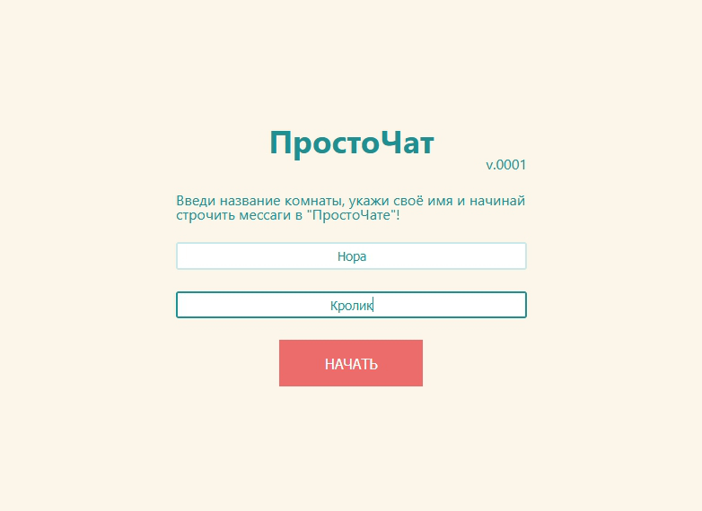
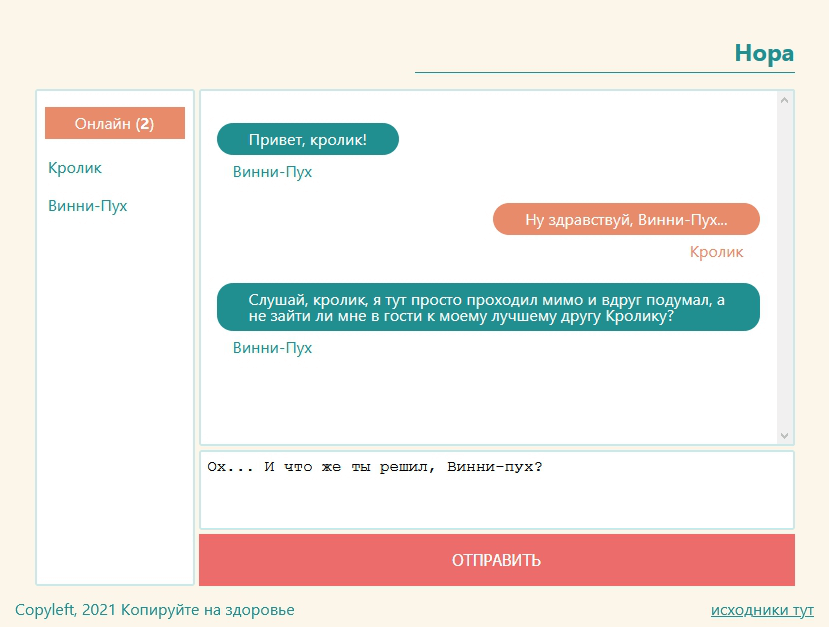

# ПростоЧат

Незатейливый чат, ничего необычного.

## Стэк

### На бэке:

NodeJS, ExpressJS, Socket.io, база в MAP

Серверная часть лежит тут:\
https://github.com/Imferal/tinychat_server

### На фронте:

ReactJS, Socket.io-client, хуки

### Сервер

Развернул на Heroku\
[tinychatserver.herokuapp.com/](tinychatserver.herokuapp.com/)

### Клиент

Поболтать в ПростоЧате можно на моём сайте по адресу:\
[http://www.frontenddeveloper.ru/chat](http://www.frontenddeveloper.ru/chat)

`ВАЖНО! Общайтесь исключительно на свой страх и риск, так как никакой конфеденциальности "ПростоЧат" не предоставляет!`

## Скриншоты

**Вход в чат - достаточно указать название комнаты и логин**

**Чат - есть список пользователей онлайн, работает автоскролл, разный стиль для своих и чужих сообщений**

